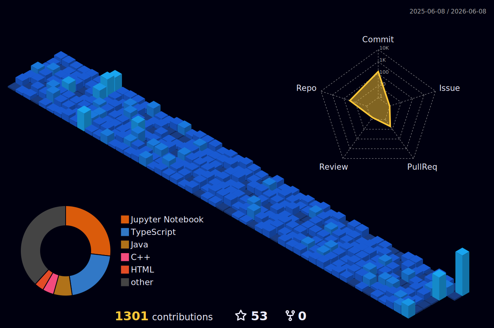

  

  

---

### 👨‍💻 About Me

- 🔭 I’m currently building **Edge AI applications** and optimizing deep learning models.
- 🌱 I’m constantly learning about **Advanced RAG, Agentic AI, and hardware acceleration**.
- 👯 I’m looking to collaborate on **Open Source AI projects** and **Web3 integrations**.
- 💬 Ask me about **Python, React, Machine Learning architectures, or System Design**.
- 📫 How to reach me: **[LinkedIn/Twitter placeholder - add your links!]**

---

### 🛠️ Tech Stack & Arsenal

<table>
  <tr>
    <td align="center" width="96">
       Python
    </td>
    <td align="center" width="96">
       TypeScript
    </td>
    <td align="center" width="96">
       React
    </td>
    <td align="center" width="96">
       TensorFlow
    </td>
    <td align="center" width="96">
       PyTorch
    </td>
    <td align="center" width="96">
       Docker
    </td>
    <td align="center" width="96">
       AWS
    </td>
  </tr>
</table>

**⚙️ Advanced Technologies & Frameworks**
 

---

### 📊 GitHub Metrics

  
  

 

### 🌌 3D Contribution Graph

  

---

  

